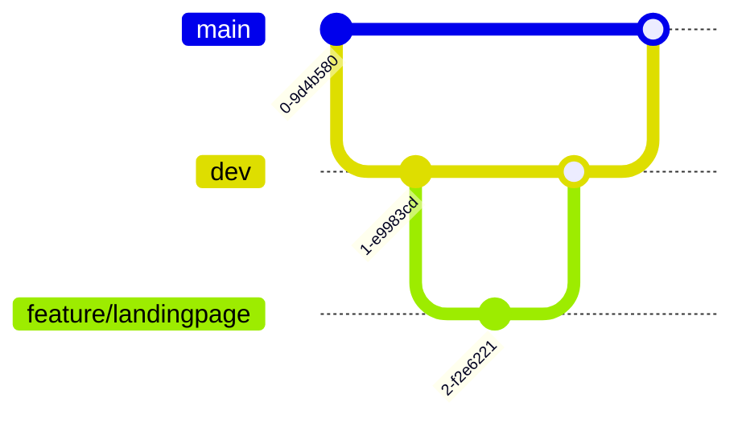

# LemonVows GitHub Setup Guide

## Repository Creation Steps

1. Go to [github.com](https://github.com) and log in
2. Click "+" → "New repository"
3. Enter these details:
   - Repository name: `LemonVows`
   - Description: `Modern wedding planning web application`
   - Visibility: Public (can be changed later)
   - Initialize with README: ✔️
   - Add .gitignore: `Node.js`
   - Choose a license: `MIT License`

## Recommended Branch Structure



- `main`: Stable production version
- `dev`: Development branch
- `feature/*`: Feature branches (e.g. `feature/landingpage-redesign`)

## First Steps After Creation

1. Clone the repository:
   ```bash
   git clone https://github.com/[Your-Username]/LemonVows.git
   cd LemonVows
   ```

2. Add existing code:
   ```bash
   cp -r /path/to/existing/code/* .
   ```

3. Make first commit:
   ```bash
   git add .
   git commit -m "Initial commit with existing codebase"
   git push origin main
   ```

## Essential Git Commands

| Command | Description |
|---------|-------------|
| `git status` | Show changed files |
| `git diff` | Show changes |
| `git log` | Show commit history |
| `git pull` | Get latest changes |
| `git checkout -b new-feature` | Create new branch |

## GitHub Automation Setup

1. Enable GitHub Actions
2. Create workflow file `.github/workflows/main.yml`:
```yaml
name: CI/CD Pipeline
on: [push]
jobs:
  build:
    runs-on: ubuntu-latest
    steps:
      - uses: actions/checkout@v2
      - run: npm install
      - run: npm test
```

## Troubleshooting

- **Authentication issues**: Use SSH keys or GitHub CLI
- **Large files**: Use Git LFS for assets
- **Merge conflicts**: Contact support if unsure

## Next Steps

1. Share repository access with collaborators
2. Set up project board for task tracking
3. Configure protected branches